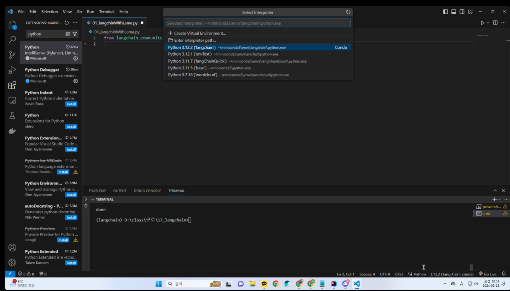

# Python 서버 설치 가이드
#### 0. 안내사항

1. env파일은 main.py와 함께 넣어주세요. (경로 안맞으면 인식 불가능)
2. python **서버만으로는 실행이 안됩니다!** 설치 확인을 위해 파이썬 main파일을 비활성화해 놓은 상태입니다. (좀 예쁘게 다듬어진 java와 함께 업데이트 할게요)   
2-1. 파이썬 코드도 자주 업데이트됩니다! 
3. 뭐 3.10버전 설치하랬다가 3.12 설치하랬다가 호환 안된다어쩌구거나 하면서 설치 과정 내내 오류가 매우 잦습니다... 인공지능 환경 구성 방법은 아직 불안정한 것 같아요. 그냥 주먹구구식실시간으로 물어봐주셔야 할 것 같습니다.
---


#### 1. miniconda 설치

https://docs.anaconda.com/free/miniconda/


컴퓨터에 파이썬과 필요한 도구들을 쉽게 설치하고 관리할 수 있게 해줍니다.


---
#### 2. VS코드 실행, 터미널 실행


---
#### 3. 가상환경 설치
```
conda create -n langchain python=3.10
```

컴퓨터에서 파이썬 프로젝트를 다룰 때, 다른 프로젝트들과 설정이나 필요한 도구들이 충돌하지 않도록 독립된 공간을 만드는 단계입니다.  
faiss-cpu가 python 3.11이후부터는 호환이 안되기 때문에 일단 다운그레이드해서 설치하고, 이후 업데이트 합니다.

---
#### 4. 가상환경 접속
```
conda activate langchain 
```
만들어둔 독립된 공간에 접속합니다.

---
#### 5. pytorch 및 관련 도구 설치
```
conda install pytorch torchvision torchaudio pytorch-cuda=11.8 -c pytorch -c nvidia
```
또는 (cpu를 기반으로 돌려야 한다면)

```
conda install pytorch torchvision torchaudio cpuonly -c pytorch
```

https://pytorch.org/get-started/locally/


---
#### 6. VS코드에서 파이썬 설정하기

```
>> ctrl+shift+p

>> Show all commands ( VS Code에서 사용할 수 있는 모든 명령어를 입력 할 수 있다.)

>> 검색 : python select interpreter

>> 3.1.2 langchain 선택 


>> 검색 결과가 아무것도 안나온다면 : vs코드 플러그인 매니저에서 python 설치하기
```
설정 완료 후 vs코드 재실행

---
#### 7. 필요한 도구 설치:
```
pip install -r requirement.txt
```
"requirement 안에 있는 거 다설치해주세요"


#### 만약 오류가 난다면 (주로 faiss-cpu 설치 문제로)
faiss-cpu가 python이 아닌 C++로 구현된 프로그램이기 때문입니다.
추가적인 도구(SWIG) 설치가 필요할 거예요.
```
>> SWIG 추가 설치 필요
>> https://jungfo.tistory.com/116
>> (python 에서 C 라이브러리 함수 호출하는법)

또는
>> Conda install faiss-cpu
>> conda update python
>> conda remove pin-1
```

---
#### 8. 설치 완료 후
main.py를 열고 터미널에 입력하기
```
>> conda activate langchain 
# 1. 가상환경 접속
# 라이브러리를 가상환경에 설치해놓고 실행합니다. 
# 실행하는 가상환경이 같다면, 라이브러리를 추가로 설치하지 않고도 실행할 수 있습니다.
# node_module import목록을 '가상환경'이라는 이름의 폴더에 싹다 설치해놓고 필요할때마다 불러와서 쓴다 = 느낌과 거의 비슷합니다!

>> python main.py
2. 실행 
main.py가 VsCode에서 열려있는지 확인해주세요

# 2-1. 방화벽에서 실행을 차단했습니다
> 두 항목 모두 체크하고 실행합니다.

>> http://0.0.0.0:8089/docs
# 3. API 문서를 볼 수 있습니다. (Swagger UI 제공)
```
이후  
결과가 이렇게 뜬다면 ok  
파이썬 포트번호는 8089를 사용합니다.

```
# Python 서버 실행중...
INFO:     Will watch for changes in these directories: ['D:\\Users\\world\\Desktop\\20240316\\div\\pythonfinalfinalTest']
INFO:     Uvicorn running on http://0.0.0.0:8089 (Press CTRL+C to quit)
INFO:     Started reloader process [9220] using StatReload
INFO:     Started server process [19648]
INFO:     Waiting for application startup.
INFO:     Application startup complete.
```
---
#### 8. 기타 명령어:
- pip list

설치된 라이브러리 목록 출력

- conda env list

가상환경 목록 출력

- conda deactivate

가상환경 종료

- conda remove --name [가상 환경 이름] --all
- conda remove --name langchain  --all

가상환경 삭제